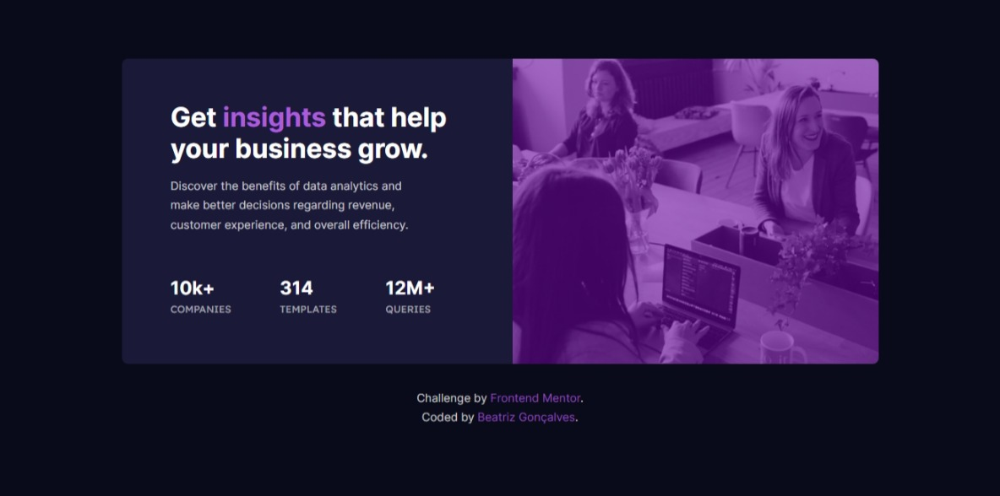
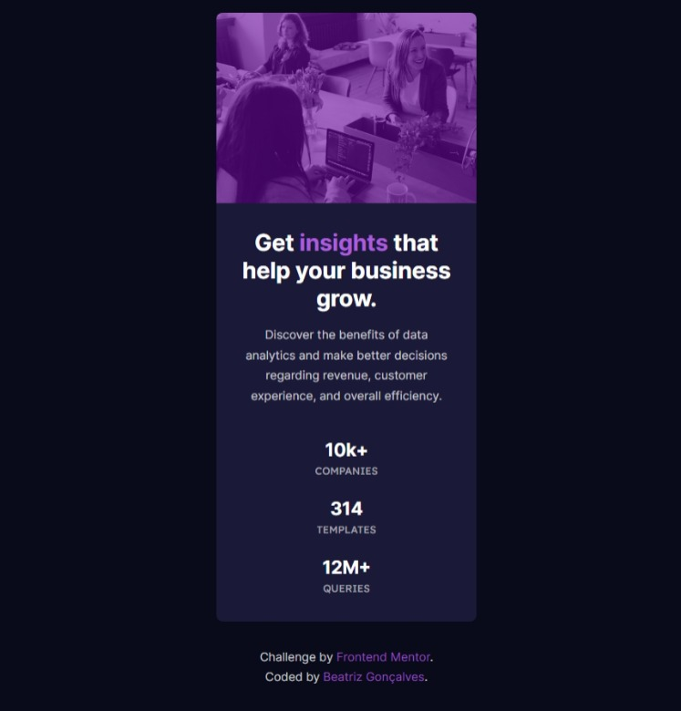

# Frontend Mentor - Stats preview card component solution

Essa é a solução para o [desafio do Frontend Mentor - Product preview card component](https://www.frontendmentor.io/challenges/stats-preview-card-component-8JqbgoU62). Os desafios do Frontend Mentor ajudam você a melhorar suas habilidades de codificação através da construção de projetos realistas.


## Tabela de conteúdos

- [Frontend Mentor - Stats preview card component solution](#frontend-mentor---stats-preview-card-component-solution)
  - [Tabela de conteúdos](#tabela-de-conteúdos)
  - [Visão Geral](#visão-geral)
    - [O desafio](#o-desafio)
    - [Screenshot](#screenshot)
      - [Desktop](#desktop)
      - [Mobile](#mobile)
    - [Links](#links)
  - [Meu processo](#meu-processo)
    - [Construído com](#construído-com)
    - [O que eu aprendi](#o-que-eu-aprendi)
    - [Desenvolvimento contínuo](#desenvolvimento-contínuo)
  - [Autora](#autora)

## Visão Geral


### O desafio

Os usuários deverão ser capazes de:

- Visualizar o layout ideal dependendo do tamanho da tela do dispositivo.

### Screenshot

#### Desktop


#### Mobile



### Links

- Solução: [Frontend Mentor](https://www.frontendmentor.io/solutions/stats-preview-card-component-solution-rff9cO6gQH)
- Site: [GitHub Pages](https://beatrizvsgoncalves.github.io/stats-preview-card-component-main/)


## Meu processo


### Construído com

- Tags semânticas
- Flexbox
- Mobile-first workflow


### O que eu aprendi

Aprendi a aplicar cor e desfoque a uma imagem.

```css
header {
    background: 
        linear-gradient(rgba(106, 7, 160, 0.6),rgba(106, 7, 160, 0.6)), 
        url("./images/image-header-mobile.jpg") center / cover no-repeat;
    filter: blur(0.04rem);
    height: 15rem;
}
```


### Desenvolvimento contínuo

Foi bom desenvolver este projeto para desenferrujar. Quero praticar mais HTML e CSS.

## Autora

- Github - [beatrizvsgoncalves](https://github.com/beatrizvsgoncalves)
- LinkedIn - [beatriz-vs-goncalves](https://www.linkedin.com/in/beatriz-vs-goncalves/)
- Frontend Mentor - [@beatrizvsgoncalves](https://www.frontendmentor.io/profile/beatrizvsgoncalves)